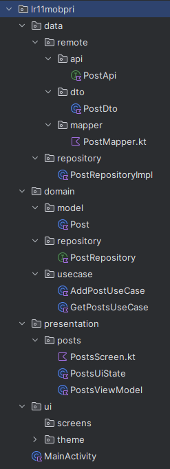

# Лабораторная работа 15-16: Clean Architecture
## Цель: 
Научиться организовывать Android-проект по слоям Clean Architecture: создавать domain- и data- слои, применять паттерн UseCase и закреплять принципы SOLID при проектировании архитектуры.
## Архитектура проекта

## Основные элементы реализации
1. Domain (не зависит от Android)
- Модель Post – без аннотаций, только поля.

- Интерфейс репозитория – абстракция для получения/передачи данных.

- UseCase – каждый сценарий в отдельном классе, использует репозиторий, может содержать бизнес-правила (валидацию).

2. Data (зависит от Domain)
- DTO PostDto – с аннотациями @SerializedName для соответствия JSON API.

- API PostApi – Retrofit методы.

- Маппер – функции расширения toDomain() и toDto().

- Реализация репозитория – вызывает API, обрабатывает ошибки, возвращает Result.

3. Presentation (зависит от Domain)
- UiState – единое состояние экрана (список, загрузка, ошибка).

- ViewModel – принимает UseCase через конструктор, вызывает их в корутинах, обновляет StateFlow.

- Compose экран – подписывается на uiState, отображает список/загрузку/ошибку.

## Скриншот работы приложения

## Результат работы
- Приложение загружает список постов из JSONPlaceholder с помощью Retrofit.

- Данные проходят путь API → DTO → маппер → domain → UseCase → ViewModel → UI.

- На экране отображается индикатор загрузки, список постов, а при ошибке – сообщение и кнопка повтора.

- Все слои чётко разделены, зависимости направлены внутрь.

- Код готов к расширению (кэширование, замена API на локальную БД, добавление новых UseCase).
